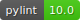
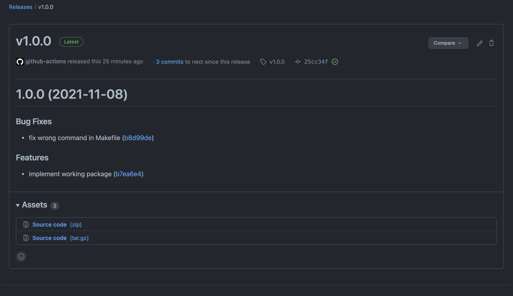

  

<!-- PROJECT LOGO -->
 

  

  <h3 align="center">Semantic Release: practical case</h3>

  

    A sample repo with semantic release.
     
    <a href="https://semantic-release.gitbook.io/semantic-release/"><strong>Explore the docs »</strong></a>
     
     
  

<!-- ABOUT THE PROJECT -->
## About The Project

This is a sample repository demonstrating how to setup automatic semantic release.

### Built With

* [semantic-release](https://semantic-release.gitbook.io/semantic-release/)

<!-- CONTACT -->
## Contact

Yann Le Guilly - [@Yannlg_](https://twitter.com/Yannlg_) - https://yannlg.tech

Blg article: [How to automate your python package release on Github](https://yannlg.tech)